### 一、Maven

#### 1.Maven的简单介绍


​		Maven的读音:['meivn],[没文],不要读成【麦文】Maven 翻译为"专家"、"内行"，是 Apache 下的一个纯 Java 开发的开源项目.

- 基于项目对象模型（缩写：POM）概念，Maven利用一个中央信息片断能管理一个项目的构建、报告和文档等步骤。

- Maven 是一个项目管理工具，可以对 Java 项目进行构建、依赖管理。

- Maven 也可被用于构建和管理各种项目，例如 C#，Ruby，Scala 和其他语言编写的项目。Maven 曾是 Jakarta 项目的子项目，现为由 Apache 软件基金会主持的独立 Apache 项目。

#### 2.什么使用Maven?

1. Maven是一个非常优秀的构建工具
   - 能够帮我们自动化构建过程、从清理、编译、测试到生产报告，再到打包和部署。我们只需要使用Maven配置好项目，然后输入简单的命令，Maven就会帮我们处理繁琐的任务。
   - Maven是跨平台的，在windows、Linux或者是Mac上，都可以使用同样的命令
   - Maven可以最大化地消除构建的重复，抽象构建的生命周期，并且为绝大多数的构建任务提供了已经实现的插件，如测试的简化
   - 让构建过程标准化，有利于项目团队的标准化
2. Maven不仅仅是一个构建工具
   - Maven是一个依赖管理工具和项目信息管理工具，它提供了中央仓库，帮助我们下载构件，省略手动下载。
   - 避免从第三方类库去下载，保持版本一致，避免冲突和依赖臃肿等问题。
   - Maven还能帮助我们管理分散在各个角落的项目号信息，包括项目描述，开发者列表，版本控制系统地址，许可证，缺陷管理系统地址等。
3. 约定优于配置（Convention Over Configuration）

#### 3.Maven的安装和配置

##### 3.1Maven的下载

官网地址：http://Maven.apache.org/

下载地址：http://Maven.apache.org/download.cgi

中央仓库：https://mvnrepository.com/ 	

安装要求：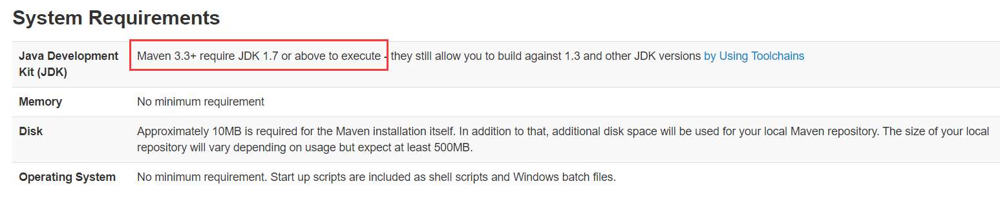

下载链接说明：

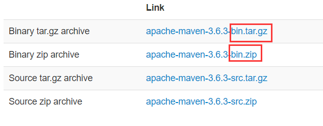

- \*-bin.tar.gz是面向Linux和Mac系统的二进制文件,\*src.tar.gz是原码文件
- \*-bin.zip是面向windows系统的，*-src.zip是原码文件

##### 3.2 Maven的安装

​		在windows平台上，解压Maven的压缩包到一个目录即可。

##### 3.3 Maven环境变量的配置

- 要求JAVA_HOME的环境变量的设置

  检查JAVA_HOME的安装：在dos命令行窗口输入：echo  %JAVA_HOME%

- 将Maven的bin目录添加到环境变量中

  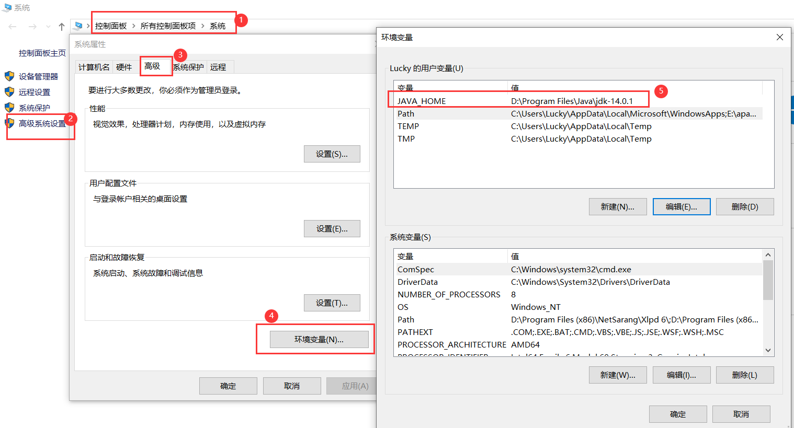

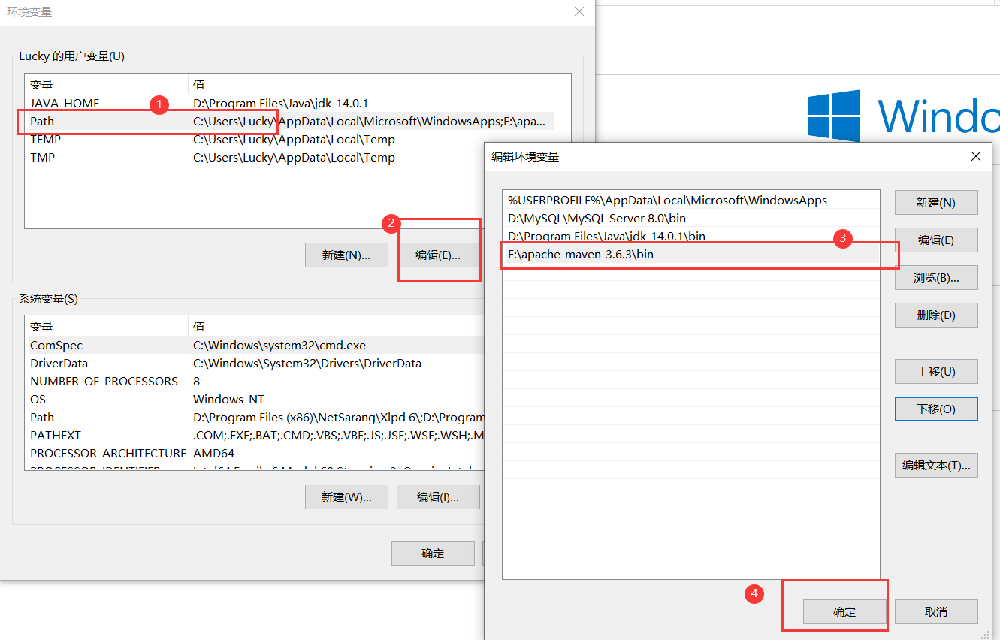

***检查Maven的环境变量是否配好：在dos命令窗口输入mvn -version***

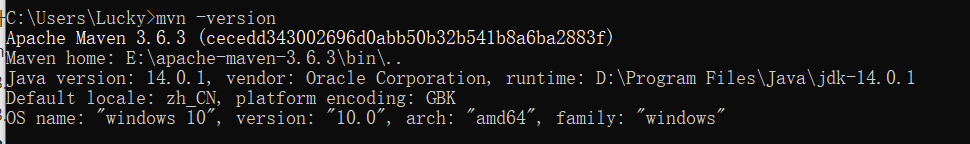

#### 4. Maven项目的目录结构

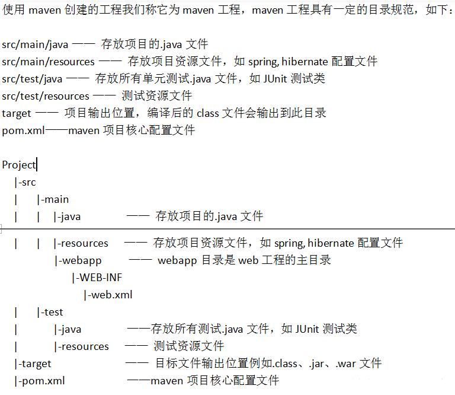

#### 5.Maven安装的目录结构和内容

- bin：mvn的运行脚本
- boot：plexus-classworlds-2.6.0.jar是一个类加载框架，相对默认的类加载器，它提供了更加丰富的语法以方便配置，Mavne使用它作为自己类库的加载器
- conf：修改settings.xml文件,可以修改Maven的全局行为
- lib：Maven运行时，需要的Java类库，

#### 6.修改Maven的配置文件:settings.xml

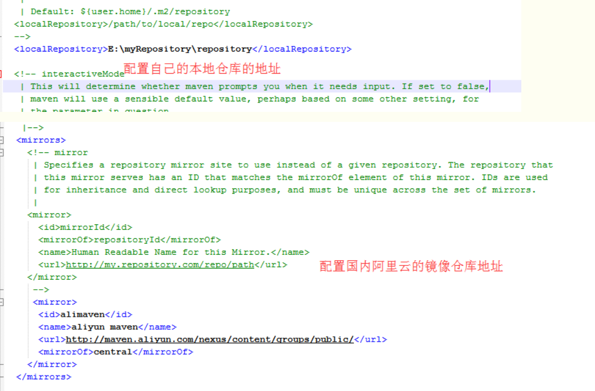

- 设置全局级别的settings.xml

  - 该文件是在Maven的安装目录下，找到conf目录，里面就有settings.xml。

  - 设置自己的中央仓库位置：Maven下载的jar包都放在这个目录

    <localRepository>D:\Maven-repository</localRepository>

    ​	D:\Maven-repository：修改的本地仓库目录

  - 升级maven时,有影响,需要重新复制一个全新的settings.xml覆盖掉原来的

- 设置用户级别的settings.xml

  - ~\\.m2\\repository：在用户目录级别下，只针对当前用户有效
  - 好处：Maven升级时不影响
  - 在conf目录去copy一个settings.xml到.m2目录

### 二、Maven的使用入门

#### 1.POM

​	POM（Project Object Model，项目对象模型）定义项目的基本信息，用于描述项目如何构建，声明项目依赖等等。

#### 2.编写第一个Maven项目

##### 2.1创建一个helloMaven的文件夹，在该文件夹中新建一个pom.xml文件，如下：

```xml
<?xml version="1.0" encoding="UTF-8"?>
<project xmlns="http://maven.apache.org/POM/4.0.0" xmlns:xsi="http://www.w3.org/2001/XMLSchema-instance"
  xsi:schemaLocation="http://maven.apache.org/POM/4.0.0 http://maven.apache.org/xsd/maven-4.0.0.xsd">
  <modelVersion>4.0.0</modelVersion>
  <groupId>com.maven</groupId>
  <artifactId>helloMaven</artifactId>
  <version>1.0-SNAPSHOT</version>
  <packaging>jar</packaging>
  <name>maven helloworld project</name>
</project>
```

- peoject元素是pom.xml的根元素
- modelVersion指明了当前POM模型的版本，针对Maven来说，只能是4.0.0。
	 groupId定义项目属于哪个组，这个组件往往和项目所在的组织或公司存在关联，比如你的公司叫mycom，创建了一个项目名为myapp的项目，那么groupId就应该是com.mycom.myapp	
- artifactId定义了当前Maven项目在组中唯一的ID。
- version指定了版本，属于不稳定版，尚处于开发中的版本；Release代表的是稳定版
- packaging代表的是打包方式，有三种打包方式：pom、jar、war
- name是对用户比较友好的项目名称,不是必须的，但是建议写出来

##### 2.2 在项目目录下创建

- src\main\java\com\maven

  注意:src\main\java是标准目录

  在目录main\com\maven下创建编HelloWorld.java文件,并且编写代码如下:

  ```java
  package com.maven;
  public class HelloWorld{
  	
  	public void sayHello(){
  		System.out.println("嗨,刷你德卡!");
  	}
  	public static void main(String[] args){
  		System.out.println("hello world!");
  	}
  }
  ```

  - 把主代码放在src\main\java\目录下，Maven会自动搜索该目录下找到项目主代码。
  - 该类定义的包名与前面定义的pom.xml中的<groupId>和<artifactId>一致
  - 好处:结构更加清晰,符合逻辑,也方便搜索构件或者Java类

##### 2.3 mvn clean compile

​	在项目的根目录，选择执行以下命令

- mvn clean :会清空目录target/
- mvn compile 编译项目主代码
- mvn clean compile  会先清空 target/，接着执行resources:resources任务(若未定义,就会略过)。最后执行compile：compile任务,将项目主代码编译至target/classes目录

##### 2.4编写测试代码

- ​	在\src\目录下创建test\java目录，然后在java目录创建一个测试类

```java
package com.maven;
import org.junit.Test;
public class HelloWorldTest{
	@Test
	public void test(){
		HelloWorld hello = new HelloWorld();
		hello.sayHello();
	}
}
```

- 在pom.xml文件中添加对Junit的依赖。

  ```xml
  <dependencies>
  	<dependency>
  		<groupId>junit</groupId>
  		<artifactId>junit</artifactId>
  		<version>4.11</version>
  		<scope>test</scope>
  	</dependency>
  </dependencies>
  ```

- 在dos命令窗口，在项目根目录执行命令：mvn clean test

  可能会报错：【请使用-source 5或更高版本以启用注释】。原因是由于历史原因：maven的核心插件之一:compile插件默认只支持Java1.3,因此需要配置该插件使其支持Java其他版本，在pom.xml文件配置,内容如下:

  ```xml
  <properties>
  		<project.build.sourceEncoding>UTF-8</project.build.sourceEncoding>
  		<maven.compiler.encoding>UTF-8</maven.compiler.encoding>
  		<java.version>14</java.version>
  		<maven.compiler.source>14</maven.compiler.source>
  		<maven.compiler.target>14</maven.compiler.target>
  </properties>
  ```

#####2.5 打包和运行

​	如何在pom.xml中没有指定打包的类型,使用默认打包类型jar,执行命令mvn clean package进行打包。

- 将打包好的jar包，安装到仓库，被其他项目引用

- 如何项目中有main方法，默认打包生成的jar是不能直接运行的，因为有main方法的类消息不会添加manifest中，为了生成可执行文件，需要借助maven-shade-plugin，配置该插件如下：

  ```xml
  <build>  
          <plugins>  
              <plugin>  
                  <groupId>org.apache.maven.plugins</groupId>  
                  <artifactId>maven-shade-plugin</artifactId>  
                  <version>3.2.4</version> 
  				 <executions>  
                      <execution>  
                          <phase>package</phase>  
                          <goals>  
                              <goal>shade</goal>  
                          </goals>  
                      </execution>  
                  </executions>  				
                  <configuration> 
  					<transformers>
  						<transformer implementation="org.apache.maven.plugins.shade.resource.ManifestResourceTransformer">
  						<mainClass>com.maven.HelloWorld</mainClass>
  						</transformer>
  					</transformers>
                     </configuration>  
              </plugin>
             </plugins>	
  </build>
  ```

### 三、坐标与依赖

#### 1.坐标

Maven的一个核心的作用就是管理项目的依赖，引入我们所需的各种jar包等。为了能自动化的解析任何一个Java构件，Maven必须将这些Jar包或者其他资源进行唯一标识，这是管理项目的依赖的基础，也就是我们要说的坐标。包括我们自己开发的项目，也是要通过坐标进行唯一标识的，这样才能才其它项目中进行依赖引用。

```xml
 <groupId>com.maven</groupId>
  <artifactId>maven-demo</artifactId>
  <version>1.0-SNAPSHOT</version>
  <packaging>jar</packaging>
  <name>maven helloworld project</name>			
```

- groupId	

  ***定义当前maven项目隶属的实际项目,不应该对应项目隶属的组织和公司，因为一个公司或者组织可能有很多项目，比如Springframework下就有spring-core、spring-tx等等***

- artifactId

  该元素定义实际项目中的一个Maven项目(模块)，推荐做法是实际项目名作为前缀

- version

  ​	定义Maven当前项目所处的版本

- packaging

  定义Maven项目打包的方式，如果不定义，Maven就会采用默认值jar

#### 2.依赖

```xml
  <dependencies>
	<dependency>
		<groupId>junit</groupId>
		<artifactId>junit</artifactId>
		<version>4.11</version>
		<scope>test</scope>
	</dependency>
  </dependencies>	
	<properties>
		<project.build.sourceEncoding>UTF-8</project.build.sourceEncoding>
		<maven.compiler.encoding>UTF-8</maven.compiler.encoding>
		<java.version>14</java.version>
		<maven.compiler.source>14</maven.compiler.source>
		<maven.compiler.target>14</maven.compiler.target>
	</properties>
```

- <dependencies>

  所有的依赖都写在<dependencies></dependencies>中，一对<dependency></dependency>代表是一个依赖

  ```xml
  <dependency>
      <groupId>junit</groupId>
      <artifactId>junit</artifactId>
      <version>4.11</version>
      <scope>test</scope>
  </dependency>
  ```

  - groupId、artifactId和version，依赖的基本坐标，对一个依赖来说，基本坐标最重要。

  - scope：依赖的范围，有五个值可以选择

    | 依赖范围（scope) | 对于编译classpath有效 | 对于测试classpath有效 | 对于运行时classpath有效 |              例子               |
    | :--------------: | :-------------------: | :-------------------: | :---------------------: | :-----------------------------: |
    |  ***compile***   |           Y           |           Y           |            Y            |           spring-core           |
    |    ***test***    |           —           |           Y           |            —            |              JUnit              |
    |     provided     |           Y           |           Y           |            —            |           servlet-api           |
    |  ***runtime***   |           —           |           Y           |            Y            |            JDBC驱动             |
    |      system      |           Y           |           Y           |            —            | 本地的，Maven仓库之外的类库文件 |


  - optional：标记依赖是否可选
  - exclusions：用来排除传递性依赖

####3.传递性依赖

##### 3.1什么是传递依赖

​	我们的项目需要使用到Spring Framework的jar包，我们的项目就依赖了Spring Framework，由于Spring Framework又依赖了其他的开源类库，所以我们除了下载Spring Framework的包以外，还要下载Spring Framework的依赖包，这样造成我们下载的包很大，很麻烦。

​	Maven的传递性依赖机制可以很好解决这一问题，项目依赖了spring-core，spring-core又依赖了commons-logging，那么commons-logging就会成为项目的依赖。	

​	有了传递性依赖机制，项目使用spring-core的时候，就不需要去考虑它依赖什么，也不用担心引入多余的依赖，Maven会解析各个直接依赖的POM，将那些必要的间接依赖，以传递性依赖的形式引入到当前的项目中来。


##### 3.2传递性依赖和依赖范围

|              | **compile** | **test** | **provided** | **runtime** |
| ------------ | ----------- | -------- | ------------ | ----------- |
| **compile**  | complie     | ——       | ——           | runtime     |
| **test**     | test        | ——       | ——           | test        |
| **provided** | provided    | ——       | provided     | provided    |
| **runtime**  | runtime     | ——       | ——           | runtime     |

假设A依赖于B，B依赖于C，我们说A对于B是第一依赖，B对于C是第二依赖，A对于C是传递性依赖。

最左边的一列是第一直接依赖依赖，最上面一行标识第二依赖范围，中间交叉的单元格则表示传递性依赖范围。

##### 3.3 依赖调解

举例说明：说明A->B->C->X(1.0)；A->B->X(2.0)，依赖了X的两个版本，造成依赖重复。怎么解决呢？

- 路径最优者优先
- 第一声明者优先：谁优先与在pom.xml中声明的先后顺序有关，顺序靠前的那个依赖优先

##### 3.4可选依赖

违背单一职能原则，所以不要使用可选依赖。（了解）

##### 3.5排除依赖（排除传递性依赖）

​		传递性依赖会给项目隐式地引入很多依赖，这极大简化了项目依赖的管理，但是有些时候这种特性也会带来问题。例如，当前项目有一个第三方依赖，而这个第三方依赖由于某些原因依赖了另一个类库的SNAPSHOT版本，那么这个SNAPSHOT就会成为当前项目的传递性依赖，而SNAPSHOT的不稳定性会直接影响到当前的项目。这时就需要排除掉该SNAPSHOT，并且在当前项目中声明该类库的某个正式发布的版本。还有一些情况，你可能也想要替换掉某个传递性依赖，比如Sun JTA API，Hibernate依赖与这个JAR，但是由于版权的因素，该类库不在中央仓库中，而Apache Geronimo项目有一个对应的实现。这时你就可以排除Sun JAT API，而声明Geronimo的JTA API实现。


A依赖于B，但是由于一些原因，不想传递性依赖于C，而是自己显式地依赖C。

```xml
<project>
  <modelVersion>4.0.0</modelVersion>

  <groupId>com.cc.maven</groupId>
  <artifactId>project-a</artifactId>
  <version>1.0.0</version>
  <packaging>jar</packaging>


  <dependencies>
    <dependency>
      <groupId>com.cc.maven</groupId>
      <artifactId>project-b</artifactId>
      <version>1.0.0</version>
      <exclusions>
            <exclusion>
             <groupId>com.cc.maven</groupId>
              <artifactId>project-c</artifactId>
         </exclusion>
    </exclusions>
    </dependency>

    <dependency>
      <groupId>com.cc.maven</groupId>
      <artifactId>project-c</artifactId>
      <version>1.1.0</version>
    </dependency>

  </dependencies>
</project>
```

​		上述代码中，项目A依赖于项目B，但是由于一些原因，不想引入传递性依赖C，而是自己显式声明对项目C 1.1.0版本的依赖。代码中使用**exclusions**元素声明排除依赖，exclusions可以包含一个或者多个exclusion子元素，因此可以排除一个或者多个传递性依赖。需要注意的是，声明exclusion的时候只需要groupId和artifactId，而不需要version元素，这是因为只需要groupId和artifactId就能唯一定位依赖图中的某个依赖。换句话说，maven解析后的依赖中，不可能出现groupId和artifactId项目，但是version不同的两个依赖。该例的依赖解析逻辑如下所示：

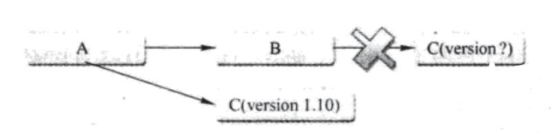


##### 3.6归类依赖

类似于定义常量的使用

```xml
<properties>
     <springframework.version>2.5.6</springframework.version>
  </properties>

  <dependencies>
    <dependency>
      <groupId>org.springframework</groupId>
      <artifactId>spring-core</artifactId>
      <version>${springframework.version}</version>
    </dependency>

     <dependency>
      <groupId>org.springframework</groupId>
      <artifactId>spring-context</artifactId>
      <version>${springframework.version}</version>
    </dependency>

     <dependency>
      <groupId>org.springframework</groupId>
      <artifactId>spring-context-support</artifactId>
      <version>${springframework.version}</version>
    </dependency>
  </dependencies>
```

​		这里简单使用到了Maven的属性，首先使用properties元素定义了Maven的属性，该例子中定义了一个springframework.version子元素，其值为2.5.6，有了这个属性之后，Maven运行的时候，会将POM中所有`${springframework.version}`替换成2.5.6，也就是说，可以使用`${}`的方式来引用Maven的属性，然后将所有Spring Framework依赖的版本值用这一属性引用。

##### 3.7**优化依赖**

​		在软件开发的过程中，程序员会通过重构等方式不断地优化自己的代码，使其变得更简洁、更灵活。同理，程序员也应该能够对maven项目的依赖了然于胸，并对其优化，如去除多余的依赖，显式声明某些必要的依赖。
maven会自动解析所有项目的直接依赖和传递性依赖，并且根据规则正确判断每个依赖的范围。对于一些依赖冲突，也能进行调解，以确保任何一个构件只能唯一的版本在依赖中存在。在这些工作之后，最后得到的那些依赖被称为已解析依赖。

可以通过运行如下命令查看当前项目的已解析依赖：`mvn dependency:list`

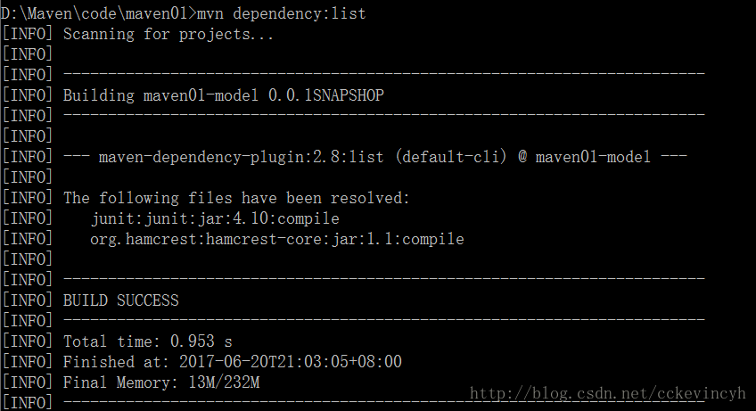

​		将直接在当前POM声明的依赖定义为顶层依赖，而这些顶层依赖的依赖则定义为第二层依赖，以此类推，有第三、第四层依赖。当这些依赖经过Maven解析之后，就会构成一个依赖树，通过这颗依赖树，就能够很清楚地看到某个依赖是通过哪条路径引入的。可以运行如下命令查看当前项目的依赖树：`mvn dependency:tree`

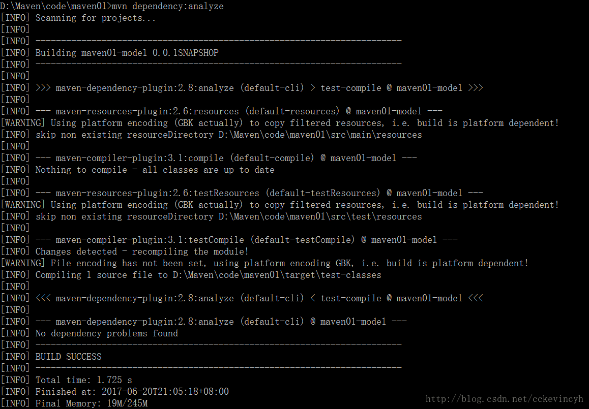

查看使用但未声明的依赖与声明但未使用的依赖  ```mvn dependency:analyze```

(***不完善***)

			### 四、仓库

在Maven的世界中，任何一个依赖，插件或者项目构建的输出，都可以称为构件。	

####4仓库的分类

- 本地仓库

  ​	Maven首先查找的本地仓库，如果找不到，采取从远程仓库查找，还是没有找到，就会报错。

- 远程仓库

  - 私服

    私服是一种特殊的远程仓库，它是架设在局域网内的仓库服务

    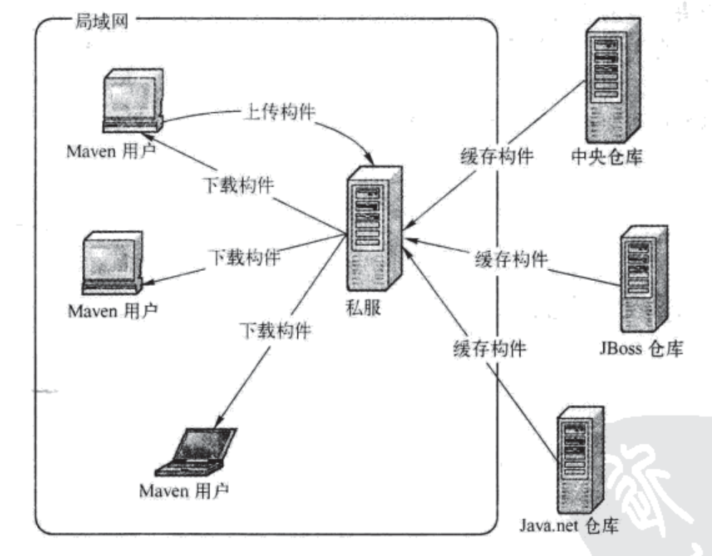

    - 节省自己的外网带宽
    - 加速Maven构建
    - 部署第三方构件
    - 提高稳定性，增强控制
    - 降低中央仓库的负荷

  - 中央仓库


